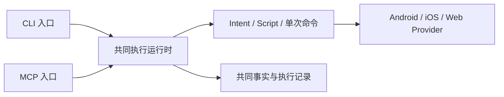
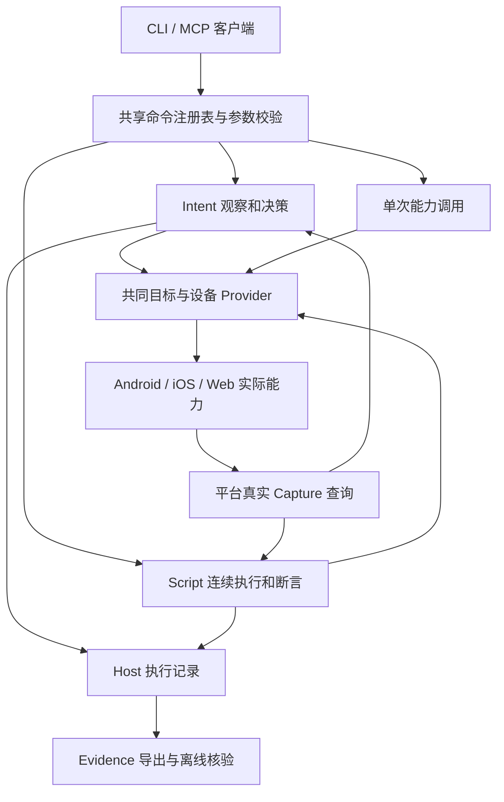

# 以 Intent / Script 为一等公民的命令体系重整

> 2026-09-11 入口一致性更新：当前 112 个注册命令均支持 CLI/MCP。两入口已连接独立共享运行时，Intent/Script、安装/权限、Web、证据与普通命令共用执行路径；长任务不再隶属于某个 MCP 连接。软件关口、干净安装包与真实 Memos 固定业务已验证，范围和未完成项见下文。下文 97/98/111 项计数属于较早阶段快照。

## CLI 与 MCP 共享执行运行时

共同目标是一个能力合同、多种入口。重构前，`mcp-server.js` 从 `ai-app-bridge.js` 导入底层 provider 函数，并不是每条请求启动一次 CLI 子进程。仅复用这些函数没有消除差异：当时 CLI 直接访问 provider，Intent/Script 会话和完整执行接线却由 MCP 持有。现已把 provider 移入 `device-provider.js`，两入口通过独立共享运行时执行安装、Intent/Script 和其他注册命令。

长任务需要持续存在的执行运行时，入口不需要为此受到能力限制。修正分为两个连续步骤：先把与 MCP 协议无关的执行模块抽离，再让 CLI 和 MCP 连接同一运行时。执行模块统一命令路由、目标准入、Intent/Script 生命周期、Web 会话、证据和历史查询；入口适配只承担参数编码、协议包装及输出。持久事实用于证据和恢复判断，不当作仍存活的任务进程。

同一环境的本地运行时独立于单次 CLI 和某个 MCP 连接存活，两种入口取得的 operationId 可以交叉查询与控制。入口断开、显式取消任务、运行时退出是三个不同事件，生命周期必须在共同合同中定义；不能继续让 MCP EOF 隐式代表整个执行运行时关闭。运行时本身意外退出时仍使用既有 interrupted/原回执恢复合同，不自动重放动作，不释放未知的物理占用。不得复制一套 CLI 专用 Intent/Script 状态机，也不能只删除 `unsupported_entrypoint` 后让任务随 CLI 进程结束。

验收围绕入口差异开展：CLI start 后退出、另一次 CLI status/observe/decide 与 MCP 交叉控制同一任务；MCP start 后由 CLI wait/cancel；相同参数错误、执行结果、证据和历史查询语义一致；两入口对同一设备的准入仍一致。安装/权限/Web 会话经过同一路径。已有 App 业务 Script 用于受影响路径的定向验收，不重新扩张无关基础矩阵。

2026-09-11 两步均已实现：协议无关的 `execution-host.js` 由独立 `execution-runtime.js` 持有，CLI 和 MCP 只通过 `runtime-client.js` 访问它。底层平台函数已移入 `device-provider.js`，发现和严格参数校验也独立成模块。所有 112 个注册命令在两入口开放；CLI 返回 `{kind,value,history?}`，MCP 包装同一个结果。`runtime start/status/stop` 明确管理进程；任务 `cancel` 管理任务；关闭 CLI/MCP 连接不取消任务。

同一规范化 FactStore 目录使用相同命名空间和 OS 锁，符号链接不再被误当成另一个存储。并发首次启动只允许一个运行时；首次选举失败且锁已释放时可重新选举，执行请求不会重放。未响应的持锁者不被自动替换。代码、设备运行时文件、原生存储二进制、Node 及关键配置不一致时明确拒绝执行，但允许查询和显式停止。调用者工作目录逐请求传入，Script 和目标内的相对工具路径在起始时固定。Web 入站证据直接持久化，旧观察器对这些记录的重复后台拉取已删除。详见[公共合同](../desktop/ai-app-bridge-cli/docs/COMMAND_CONTRACT.md#shared-runtime-lifecycle)。

本阶段 Host 全量执行 1203 项：1201 项直接通过，剩余 2 项为要求保留旧 Web 轮询代码的静态断言；更新后所在的 12 项定向检查全部通过。覆盖跨入口 Script/Intent、断连后继续、CLI JSON 决策、同时首次启动、未响应所有者、运行时退出及真实进程 SIGKILL 后原设备回执恢复。日志保留于 `build/ai_app_bridge_artifacts/shared-runtime-20260911-02/`，其中 `host-suite-final.log` 保留原失败，不伪造为一次全绿。

干净 npm tarball 安装及原生编译通过，安装包公开 112 项命令，真实安装入口完成 CLI start→MCP wait→MCP 断连→CLI decide→新 MCP 查询同一运行时；安装/权限与退出合同也通过受控端口检查。[安装包报告](../build/ai_app_bridge_artifacts/shared-runtime-package-20260911-02/report.json)，tarball SHA-256 为 `8b0a25a85584ddb45aa2d6dd628a2066c42e4c994f50836cea01951f48d91138`。这部分不增加真机业务验收范围。

受影响的实际业务使用原 Memos 0.30.0 固定 JS Script：CLI 启动首页观察 Intent，MCP 完成；随后 CLI 启动创建→搜索 Enter→编辑→取消删除，MCP 读取完成。运行时计时 1.242 秒，13 项页面断言、12 项独立 SQLite 核对全部通过，既有两条笔记不变。Intent 和 Script 均由 CLI 导出并在运行时停止后离线核验。[业务证据](../build/ai_app_bridge_artifacts/shared-runtime-20260911-02/memos-entry-01/report.json)。这是本地既有会话上的固定流程耗时，不是冷启动或整机回归速度结论。

入口差异的本阶段关口关闭。下一项回到真实复杂业务：Memos Python 同义流程与复选控件观察/操作，以及原计划尚缺的 iOS H5 提交、多 WebView、LocalSend 实际收发与整机组合；现有三类 iOS 技术和 Android 固定业务证据不因本阶段自动扩张。先前 `shared-runtime-20260911-01/` 的模块抽离和 111 项安装包结果仅为历史中间步骤。

[第三阶段 U：WDA 原任务取消与持久恢复](COMMAND_PRODUCTION_PHASE3U_2026-09-10.md)已完成软件关口：WDA 写操作统一受管执行，排队取消不派发，已提交 XCTest 事件只由原回调结束；真实分段存储提交完成记录，Host 重启后只凭原 Runner/action/epoch/目标恢复物理占用。44 项 Host 定向检查、原生真实磁盘故障与冷读检查及实际 arm64 Runner 构建通过。Android 固定矩阵继续冻结。iOS 输入/焦点与真机闭环待设备接入；本机没有可用模拟器运行时。下一项独立开发转向 Web 生命周期与存查合同，不重复 WDA 已通过的软件检查。iOS/Web Intent/Script 仍关闭，整体生产验收未完成。

基线：`4da58fa` 的 97 个公开命令。覆盖方式为逐项对照 capability、CLI/MCP/provider 分派、Script allowlist、目标/副作用、查询来源、参数和错误；不是只检查用户举出的命令。本表每个基线命令恰有一行，并补充后来新增的共享能力，记录已做和待做。当前 98 个入口的机器合同见 [第三阶段 U 快照](audits/2026-09-10/command-contract-phase3u.json)；阶段 O 的 96 项和阶段 D 的 93 项快照继续保留。基线审计保留不改，避免把后续实现写成当时已有。

第三阶段 A 已统一普通 Android 命令与 Script 的 Host 执行预算、完整变更分类、取消/退出及写盘收尾，见[验证结果](COMMAND_PRODUCTION_PHASE3_2026-09-08.md)。语义定位与 wait-text 见[第三阶段 B](COMMAND_PRODUCTION_PHASE3B_2026-09-08.md)，普通 Intent 生命周期及持久恢复见[第三阶段 C](COMMAND_PRODUCTION_PHASE3C_2026-09-08.md)。操作分支与嵌套合同已通过[第三阶段 D](COMMAND_PRODUCTION_PHASE3D_2026-09-08.md)；Native tap/input 的 SDK 目标校验首批关口已通过[第三阶段 E](COMMAND_PRODUCTION_PHASE3E_2026-09-09.md)，输入回调重入缺口和 SDK 主线程故障集成见[第三阶段 F](COMMAND_PRODUCTION_PHASE3F_2026-09-09.md)。Native 手势与真实执行中取消、Intent/Script 共用及采证修复见[第三阶段 G](COMMAND_PRODUCTION_PHASE3G_2026-09-09.md)。Flutter Element/编辑器/嵌套滚动绑定与同义真机流程见[第三阶段 H](COMMAND_PRODUCTION_PHASE3H_2026-09-09.md)。Flutter Android 的远端取消、传输期限及引擎交接见[第三阶段 I](COMMAND_PRODUCTION_PHASE3I_2026-09-09.md)。跨进程 serial 所有权与 Flutter 未知回执恢复见[第三阶段 J](COMMAND_PRODUCTION_PHASE3J_2026-09-09.md)。Native 共同执行协调、原结束凭据恢复及普通命令/Intent/Script 的持久 executionReceipt 见[第三阶段 K](COMMAND_PRODUCTION_PHASE3K_2026-09-09.md)。Android shell/UIA 的原任务结束凭据、准入前取消、Host 崩溃恢复和有界留存见[第三阶段 L](COMMAND_PRODUCTION_PHASE3L_2026-09-09.md)。H5 执行结束凭据、DOM 语义与空值查询、Host 崩溃恢复和两种 Script 真机验证见[第三阶段 M](COMMAND_PRODUCTION_PHASE3M_2026-09-09.md)。安装原任务/PackageInstaller session 的结束身份、真实回执丢失恢复与普通 MCP 历史失败合同见[第三阶段 N](COMMAND_PRODUCTION_PHASE3N_2026-09-09.md)。以上为各批历史证据；后续状态以本文开头和[当前剩余关口](BRIDGE_NEXT_GATES_2026-09-08.md#固定剩余关口与停止条件)为准，不由旧段落重新触发已通过的回归。共享基础完成不等于各命令逐项通过生产验收。

## 设计裁决

[第三阶段 P：iOS 持久采证](COMMAND_PRODUCTION_PHASE3P_2026-09-10.md)已完成源码接线与本机验证：四类公开采证统一读写分段存储，删除内存后端和旧回执原型；保留原 actionId、返回真实排队回执，查询在同一次写入队列操作中刷盘并固定提交边界。58 项 Swift 检查（其中 17 项真实磁盘采证场景）、12 项 Host 采证接线检查、iOS arm64 App 编译和 Flutter iOS 实际框架类型检查通过。已通知用户接入 iOS 设备，目前只有不可用的历史配对记录；真机公开接口、真实进程重启和跨平台 Intent/Script target 尚未验收。Android 两款样例矩阵维持关闭，不因本批改动重跑；整体生产验收仍未完成。

目标是让 Agent 日常以 Intent 操作与取得证据，基于这些经验编写可重复 Script；同样允许直接编写有真实验收依据的 Script。基础命令承担观察、交互、安装、环境准备和诊断，不因一等执行入口出现而弱化。

图中的跨平台 provider 已有直接命令；当前 Intent/Script 完整目标与真机链路仍以 Android 为范围。图不表示 iOS/Web 执行和持久查询已经等价实现。

- **一个能力合同，多种调用方式。** 注册表描述类型、目标、角色、平台、Script permission；CLI/MCP 和 Script provider 校验复用它。MCP 是协议入口，不是 Script 子动作必须经过的 JSON 转发层。
- **自动选择必须保留。** tap-text 的自动 provider 选择属于观察和定位能力。读取失败时可继续发现其他来源，多个目标或页面变化明确失败。选定后一次派发，结果未知先重新观察。不同设备框架的判断不用推给用户；固定回归可以显式绑定 provider。
- **必要原语保持可用。** 物理点击/滑动/按键、SDK Unicode 输入、权限状态与夹具控制、安装、启动、清数据、设备日志和 CDP 诊断各有独立价值。区分普通能力和专家能力，不按名字数量裁剪。
- **连续执行只有一套控制。** batch 与 Script 重复且缺少完整控制和断言，因此移除。不能再造一个强化 batch 与 Script 平行发展。普通的一步调用仍保留。
- **目标一致性优先于别名兼容。** 当前各 Android 变更入口共用物理 serial 租约；App identity 继续用于事实归属。不同包不代表两部手机。同一 OS 用户及共享目录的跨进程所有权已实现；不同 serial 别名和跨主机尚未覆盖。
- **真实来源决定结论。** 手机 Capture、Host Ledger、UI 观察、设备 logcat 和 Web/CDP 临时会话分别有来源与保留范围。统一查询合同不能制造持久化或跨平台等价证据。普通 MCP `_history` 单独公开本次历史保存的 stored/partial/unavailable/disabled；辅助写盘失败不覆盖原动作结果，也不重放动作。后台 observer 和手机 coverage 保留独立边界。

## 本轮实现与明确边界

已实施：公共参数入口的基础类型校验和能力发现（当前 98 项）；旧多工具/别名/重复外层参数清理；删除旧 dispatcher、MCP Script 转发与未使用旧 adapter；真实 tarball 安装验证；同一 OS 用户及共享目录的跨进程 Android serial 仲裁；Native tap/input/gesture 和 Flutter tap/input/scroll 的 SDK 目标绑定；自动文字 provider 定位；输入/清数据/WDA 不确定结果不再换通道重放；请求内容冲突；Script 的实际平台和可选生命周期/权限夹具能力；安装入口复用 supervised Intent，删除 ROM/按钮文案判断，以独立 APK 身份核验收口；权限弹窗复用 Intent，以请求 App/用户/Activity、实时权限状态与弹窗关闭核验四种 outcome，保留独立查询与权限夹具。

仍需逐项完成的工作统一列于[固定剩余关口](BRIDGE_NEXT_GATES_2026-09-08.md#固定剩余关口与停止条件)。平台目标联合类型、Host 预算、已有 Android 目标/取消和 iOS SDK/WDA 软件恢复不再作为待重做事项；只有明确源码变化或新的反证才重开对应检查。

当前共 98 个命令，未宣称“所有命令全部生产验收”。保留意味着其能力必要，重设计意味着合同/实现还有工作；单元/模拟传输、实际安装包和真机固定场景的证据分别记录在各阶段结果中。

## 全部命令的处置

所有保留入口已纳入共享 schema/能力发现。表中“后续重点”延续源码审查结果，不把本轮未实施的内容写成完成。

| 命令 | 角色 / 处置 | 本轮结论 | 后续重点 |
| --- | --- | --- | --- |
| `status` | 共享能力；保留 | 保留；补共享 schema 和平台可执行范围。身份/持久化 attachment 继续以实际返回为准。 | 保留身份、runtime epoch、持久化接入状态；能力发现需区分已实现与已验证。 |
| `tree` | 共享能力；保留 | 保留；纳入共享参数与目标合同。Script 可按 app.read 使用。 | 不同观察来源有实际用途；统一观察 ID、时间、目标、坐标空间及缺失原因，截图/树不能单独代表业务成功。 |
| `uia-tree` | 共享能力；保留 | 保留系统观察；改为持久 UIA 运行时的绑定快照，错误直接返回；maxDepth 与数量合同已通过公开 MCP/发行包读取验证。 | 不同观察来源有实际用途；统一观察 ID、时间、目标、坐标空间及缺失原因，截图/树不能单独代表业务成功。 |
| `screenshot` | 共享能力；保留 | 保留；纳入共享参数与目标合同。Script 可按 app.read 使用。 | 不同观察来源有实际用途；统一观察 ID、时间、目标、坐标空间及缺失原因，截图/树不能单独代表业务成功。 |
| `logs` | 共享能力；保留 | 保留；纳入共享参数与目标合同。Script 可按 capture.read 使用。 | Android attached 后读持久事实；初始化/失败时仍可能为内存后端。明确 live、history、decision-window、分页和 coverage，网络字段过滤须保持 refs 对齐。 |
| `network` | 共享能力；保留 | 保留；纳入共享参数与目标合同。Script 可按 capture.read 使用。 | Android attached 后读持久事实；初始化/失败时仍可能为内存后端。明确 live、history、decision-window、分页和 coverage，网络字段过滤须保持 refs 对齐。 |
| `state` | 共享能力；保留 | 保留；纳入共享参数与目标合同。Script 可按 capture.read 使用。 | Android attached 后读持久事实；初始化/失败时仍可能为内存后端。明确 live、history、decision-window、分页和 coverage，网络字段过滤须保持 refs 对齐。 |
| `events` | 共享能力；保留 | 保留；纳入共享参数与目标合同。Script 可按 capture.read 使用。 | Android attached 后读持久事实；初始化/失败时仍可能为内存后端。明确 live、history、decision-window、分页和 coverage，网络字段过滤须保持 refs 对齐。 |
| `logcat` | 共享能力；保留 | 保留；纳入共享参数与目标合同。Script 可按 capture.read 使用。 | 系统/其他 App 无 SDK 时有独立价值；明确 PID 与整机范围、清缓冲的副作用、截断及退出原因。 |
| `smoke` | 移除 | 移除通用入口及其硬编码 sample 执行实现；sample 验证由自己的 runner 承担。 | 无独立兼容入口。 |
| `install-apk` | 一等执行；重构后保留 | MCP 启动同一 Intent 状态机；冻结 APK 并验签/解析 manifest，一次手机托管任务绑定原 PackageInstaller session；实时观察和 Agent 唯一 selector 决策，原 commit 结果与独立设备 APK hash 共同核验。未知回执保留占用，reconcile 查询原任务并持久保存完整证明。 | 当前单 base APK / Android；3N 已验证准入前取消、原结果丢失后的取消/超时/Host SIGKILL 恢复和 signer 拒绝；进行中安装主动终止、多 ROM、残留退役与完整端到端 deadline 仍待补。安装作为 Script 前置准备，非同步 ctx.call。 |
| `clear-app-data` | 共享能力；重构后保留 | 增强：明确 pm-clear/runtime 二选一；只执行已选通道，超时不再次清数据。Script 可显式声明 app.lifecycle。 | 通道已明确且不确定时不切换；继续补独立清除结果、运行中取消与存储故障。 |
| `freeze-app` | 专家能力；专家能力 | 保留；纳入共享参数与目标合同。作为明确的直接诊断/管理能力。 | 不是常规页面稳定机制；信号操作需权限/超时/恢复约束，避免将停住 App 留给下一次操作。 |
| `thaw-app` | 专家能力；专家能力 | 保留；纳入共享参数与目标合同。作为明确的直接诊断/管理能力。 | 不是常规页面稳定机制；信号操作需权限/超时/恢复约束，避免将停住 App 留给下一次操作。 |
| `launch-app` | 共享能力；保留 | 保留；纳入共享参数与目标合同。Script 可按 app.interact 使用。 | 分别保留默认 launcher 与显式 component 用途；已有 launcher_ambiguous，统一启动结果、目标、clearTask 和 extras 合同。 |
| `launch-activity` | 共享能力；保留 | 保留；纳入共享参数与目标合同。Script 可按 app.interact 使用。 | 分别保留默认 launcher 与显式 component 用途；已有 launcher_ambiguous，统一启动结果、目标、clearTask 和 extras 合同。 |
| `launch-native-test` | 移除 | 移除硬编码 Native test Activity；用显式 launch-activity。 | 无独立兼容入口。 |
| `launch-flutter` | 移除 | 移除硬编码 MainActivity 与 sample route；普通 Flutter 启动使用真实 launch-app。 | 无独立兼容入口。 |
| `permission-state` | 共享能力；保留 | 已重整；实时读取指定包、用户和 runtime permissions，正确解析竖线分隔 flags，拒绝缺失/不支持的数据。Script 可按 app.read 使用。 | 真实 dumpsys 权限状态有价值；明确权限不存在、权限状态未知、设备不可读的不同错误。 |
| `permission-grant` | 专家能力；专家能力 | 已重整夹具能力；冻结实际 Android user，一次 pm 操作后独立读回验证；系统拒绝、结果未知分别返回。Script 可显式声明 app.permissions。 | 测试夹具控制有价值；默认流程用真实系统授权交互。明确作用范围、枚举、持久化影响和复核结果。 |
| `permission-revoke` | 专家能力；专家能力 | 已重整夹具能力；冻结实际 Android user，一次 pm 操作后独立读回验证；系统拒绝、结果未知分别返回。Script 可显式声明 app.permissions。 | 测试夹具控制有价值；默认流程用真实系统授权交互。明确作用范围、枚举、持久化影响和复核结果。 |
| `permission-dialog` | 执行入口；已重设计 | MCP 返回 supervised Intent；绑定请求 App/用户/UID/Activity，按实际观察决策，验证 allow / allow-once / deny / dismiss。取消只停止任务，保留实际界面与授权状态。 | 删除固定 allow 文案/ID/重试；独立 PackageManager 结果和原 Activity 关闭共同收口；Script 保留原语回放、状态断言和 askAgent，不嵌套此工作流。 |
| `appops-set` | 专家能力；专家能力 | 保留专家夹具能力；共享校验与仲裁、可选 app.permissions；op/mode 平台枚举和复核仍待收口。 | 测试夹具控制有价值；默认流程用真实系统授权交互。明确作用范围、枚举、持久化影响和复核结果。 |
| `tap` | 共享能力；重构后保留 | 增强：scope、有限非负坐标、明确 serial、包前台保护；SDK 结果未知不会切 ADB 重放。 | 保留物理坐标原语；拒绝 null/boolean/越界参数。App-local 目标不符时必须停止，不能继续 ADB 点击。 |
| `tap-text` | 共享能力；重构后保留 | 增强自动发现：Native→Flutter→UIA 只在观察阶段选择；可固定 provider；返回观察/匹配来源、拒绝多匹配，选定后仅派发一次；Native 使用 SDK 实例引用与专用语义端点。 | Native/Flutter 目标绑定与执行恢复见阶段 E–K；UIA shell 完成凭据见 3L，系统窗口的原子目标绑定仍待补。 |
| `tap-uia-text` | 共享能力；重构后保留 | 已与 tap-text 共用精确唯一选择、派发前重定位和前台检查，使用 device scope 并传播动作失败。 | 继续统一底层 UIA 树遍历、窗口/祖先约束和 SDK 原子目标校验。 |
| `wait-text` | 共享能力；重构后保留 | 已统一毫秒 deadline、精确文字数组、同一次前台观察和失败语义；纯消失要求明确 provider，读取失败不证明消失。Script 共用同一能力。 | 纳入普通 Intent 整体预算；与 H5/iOS/Web 等待接口继续对齐。 |
| `input-text` | 共享能力；重构后保留 | 保留 Unicode SDK 输入；去掉不确定 SDK 输入后 ASCII ADB 重放；成对坐标和空字符串语义已校验；无坐标必须有焦点编辑器，不选任意第一项。Intent 输入另有 SDK 目标引用校验。 | 3F/3K 已覆盖输入连接/焦点重入、阻塞回调期间取消、迟到写入阻止和结束回执；继续其他 Android 版本与持续运行。 |
| `keyboard-state` | 共享能力；保留 | 保留；纳入共享参数与目标合同。Script 可按 app.read 使用。 | 读键盘与收键盘有独立用途；区分启发式状态与实证，明确收键盘使用何种动作及结果。 |
| `hide-keyboard` | 共享能力；保留 | 保留；纳入共享参数与目标合同。Script 可按 app.interact 使用。 | 读键盘与收键盘有独立用途；区分启发式状态与实证，明确收键盘使用何种动作及结果。 |
| `swipe` | 共享能力；重构后保留 | 保留显式 ADB 物理坐标原语，严格坐标、持续毫秒范围和设备仲裁；Native 控件绑定手势使用 native-gesture。 | 3L 已接入原 shell 任务、准入前取消、执行后自然收尾及断连恢复；仍需物理长滑动专项，动作执行不等于业务成功。 |
| `device-ownership` | 执行控制；新增 | 同一 OS 用户及共享目录内按 serial 独占；status 只读占用，reconcile 凭原结束回执恢复并排空持久确认队列；receipt 按 serial/epoch/actionId 查询原文或明确脱敏的 FactStore 记录，不强制清除、不重放。 | 3J–3N 已验证真实 Host SIGKILL 后阻断及 Native/Flutter/H5/Android shell/安装原身份回执恢复；恢复历史独立持久保存。未知回执继续阻断，不能凭 idle 或安装物相同解锁；通用 CDP/HTTP 及其余平台协议仍待补。 |
| `uia-runtime` | 专家生命周期控制；新增 | API 33+ 的节点运行时；status 只读，start/stop 共用设备占用；start 探测并重获 OS 锁，未知历史阻止重开，token 不进入公开返回；新观察可轮换已写满且全部确认的会话。 | 3O 已验证已确认记录的安全退役、连续 257 次动作和已结算后进程退出的重开；停机后原终态确认已有 PKR110 实证；prepared 阶段双进程退出恢复已通过；继续真实 queued/重启/未知回调和 instrumentation 交接。 |
| `native-gesture` | 共享能力；新增 | Native 长按/滑动/滚动共用 SDK 引用、执行时几何及取消合同；Intent 与公开 MCP/CLI、JS/Python Script 共用，app.interact 授权。 | 3G/3K 已有正常/故障/执行中取消、真实采证及统一 Native 原回执恢复；继续其他 Android 版本与连续运行。 |
| `keyevent` | 共享能力；重构后保留 | 保留物理原语；0 不再变成返回键；显式设备、参数和仲裁统一。 | 保留设备输入；统一单位、数值范围和目标租约，keyCode=0 不得被隐式变成 4；动作执行不等于业务成功。 |
| `flutter-tree` | 共享能力；收敛入口 | 保留当前必要视图/平台适配；统一参数入口。只在来源、返回值和性能合同等价后合并内部实现，当前不机械删命令。 | 全树与 operable 投影来自同一快照，宜同一观察接口的明确 view；实际 shape/性能等价前保留两者，不盲删。 |
| `flutter-nodes` | 共享能力；收敛入口 | 观察真实 Element 引用、空编辑器、分别标识的嵌套 Scrollable，并返回滚动方向/位置/边界。截断树不能用于证明唯一目标。 | 多窗口、大树与运行实例重启继续验收；动态 nodeId 不作为跨运行夹具。 |
| `flutter-action` | 专家能力；专家能力 | 专家 typed payload 保留，SDK 严格校验字段并串行执行。Host 语义动作绑定实际 SDK 引用；公开 payload 禁止注入 targetRef/actionId。 | 远端取消、MethodChannel 阻塞、未知结果与传输期限继续验收。 |
| `tap-flutter` | 共享能力；保留 | 支持 selector 或显式逻辑坐标；语义分支由 SDK 核验真实 Element，在自身当前可见位置发送触摸。Script 可按 app.interact 使用。 | 逻辑坐标原语保留；原生前台窗口竞争、远端取消与 iOS 同义验证待补。 |
| `tap-flutter-text` | 共享能力；重构后保留 | 与 tap-text 共用精确唯一选择，Host 与 SDK 两次核验对象引用；语义点击按 Element 本身的位置派发，移除祖先中心误点。 | 自动 provider 发现继续保留；动作结束不代表页面动画完成，后置结果须重新观察。 |
| `input-flutter-text` | 共享能力；重构后保留 | 接受 selector、坐标或焦点/唯一编辑器；绑定 EditableText/controller/FocusNode，等待帧后重验并向原编辑器写入，覆盖 Unicode/清空及焦点重入。 | App 回调不具备事务回滚；公开远端取消、阻塞与原生窗口竞争待补。 |
| `scroll-flutter` | 共享能力；重构后保留 | 绑定真实 Scrollable/ScrollPosition；同矩形嵌套容器分别显示，可指定 selector。零位移/边界明确拒绝，原容器被替换则引用失效。 | 长 scrollUntilText 的完整预算、取消/断连收尾及大列表需继续验收。 |
| `h5-dom` | 共享能力；保留 | 保留；纳入共享参数与目标合同。Script 可按 app.read 使用。 | 3M 已统一前台窗口与唯一 shown WebView，value 区分空值和标签；多页面/frame 选择、截断明示和只读排队期限仍待完善。 |
| `h5-eval` | 专家能力；专家能力 | 保留；纳入共享参数与目标合同。作为明确的直接诊断/管理能力。 | 3M 已实现原身份结束凭据、排队取消和未知恢复；任意 JS 仍为专家能力，回调结束不代表异步业务结束。 |
| `h5-click` | 共享能力；重构后保留 | 保留；纳入共享参数与目标合同。Script 可按 app.interact 使用。 | 3M 已统一 DOM 脚本、selector/targetText 二选一与 exact；重复/隐藏目标拒绝，真实 WebView 单次语义点击与回执通过。 |
| `h5-input` | 共享能力；重构后保留 | 保留；纳入共享参数与目标合同。Script 可按 app.interact 使用。 | 3M 已支持严格字符串 value、空值清除和焦点回调后重验；DOM 查询独立 value，真机与 CDP 校验通过。 |
| `h5-wait` | 共享能力；重构后保留 | 保留；纳入共享参数与目标合同。Script 可按 app.interact 使用。 | 3M 已迁移 timeoutMs/intervalMs 与每次 poll 的原身份凭据；只重试确定未匹配，执行错误立即返回。 |
| `h5-scroll` | 共享能力；重构后保留 | 保留；纳入共享参数与目标合同。Script 可按 app.interact 使用。 | 3M 与 Flutter H5 共享 DOM 脚本，保留显式零值和机器错误；真实非零滚动与多容器页面仍需专项。 |
| `flutter-h5-dom` | 共享能力；收敛入口 | 保留当前必要视图/平台适配；统一参数入口。只在来源、返回值和性能合同等价后合并内部实现，当前不机械删命令。 | 实现适配至 H5，建议同一 H5 命令合同配显式 provider；先完成不同桥接返回值/上下文一致性验证。 |
| `flutter-h5-eval` | 专家能力；专家能力 | 保留；纳入共享参数与目标合同。作为明确的直接诊断/管理能力。 | 3S 已接排队取消、原回调持久化和 Host 未知结果阻断/恢复。任意 JS 仍是显式 mutation；多 WebView 身份与真机验收待做。 |
| `flutter-h5-click` | 共享能力；收敛入口 | 保留当前必要视图/平台适配；统一参数入口。只在来源、返回值和性能合同等价后合并内部实现，当前不机械删命令。 | 实现适配至 H5，建议同一 H5 命令合同配显式 provider；先完成不同桥接返回值/上下文一致性验证。 |
| `flutter-h5-input` | 共享能力；收敛入口 | 保留当前必要视图/平台适配；统一参数入口。只在来源、返回值和性能合同等价后合并内部实现，当前不机械删命令。 | 实现适配至 H5，建议同一 H5 命令合同配显式 provider；先完成不同桥接返回值/上下文一致性验证。 |
| `flutter-h5-wait` | 共享能力；收敛入口 | 保留当前必要视图/平台适配；统一参数入口。只在来源、返回值和性能合同等价后合并内部实现，当前不机械删命令。 | 实现适配至 H5，建议同一 H5 命令合同配显式 provider；先完成不同桥接返回值/上下文一致性验证。 |
| `flutter-h5-scroll` | 共享能力；收敛入口 | 保留当前必要视图/平台适配；统一参数入口。只在来源、返回值和性能合同等价后合并内部实现，当前不机械删命令。 | 实现适配至 H5，建议同一 H5 命令合同配显式 provider；先完成不同桥接返回值/上下文一致性验证。 |
| `webview-pages` | 专家能力；专家能力 | 保留；纳入共享参数与目标合同。作为明确的直接诊断/管理能力。 | CDP 选页诊断保留；多 socket/page 必须显式选择，不能将默认第一页当目标身份。 |
| `webview-network` | 共享能力；保留 | 保留；纳入共享参数与目标合同。Script 可按 capture.read 使用。 | 这是按时长现场采集的 CDP 结果，不是手机持久历史；明确会建立连接、截断与会话范围，不能宣称现成 durable coverage。 |
| `webview-console` | 共享能力；保留 | 保留；纳入共享参数与目标合同。Script 可按 capture.read 使用。 | 这是按时长现场采集的 CDP 结果，不是手机持久历史；明确会建立连接、截断与会话范围，不能宣称现成 durable coverage。 |
| `ios-doctor` | 共享能力；保留 | 3T 分别报告开发隧道、DDI、SDK 和绑定 WDA；ready 同时要求四者。 | 连接条件已有软件证明；真机和持久证据可用性仍独立验收。 |
| `ios-setup` | 专家能力；保留 | 3T 固定 WDA 14.1.1 准备器、显式签名/Runner ID、已绑定实例复用，以及实际子进程取消/期限关闭。 | 真机签名、安装/启动独立结果、Host 被杀后的原任务恢复继续验收。 |
| `ios-devices` | 共享能力；保留 | 保留直接平台能力；统一基础参数/错误入口，目录明确 Script 平台尚未接通。 | 只读环境/设备发现保留；设备歧义错误已有，需把 WDA、SDK、持久化证据可用性分别报告。 |
| `ios-install-app` | 共享能力；重构后保留 | 保留直接平台能力；统一基础参数/错误入口，目录明确 Script 平台尚未接通。 | 当前 devicectl 安装返回即 ok；补目标包身份、版本和独立安装结果验证，平台能力不能冒充 Android 安装 Intent。 |
| `ios-launch-app` | 共享能力；保留 | 保留直接平台能力；统一基础参数/错误入口，目录明确 Script 平台尚未接通。 | 保留显式 bundleId 启动，补前台与运行实例结果合同；真机同义验收仍待做。 |
| `ios-status` | 共享能力；保留 | 保留直接平台能力；统一基础参数/错误入口，目录明确 Script 平台尚未接通。 | 分别属于 SDK/WDA 观察；标明来源、设备、bundle、generation、坐标空间与是否同一前台，不用存在端点替代实测。 |
| `ios-tree` | 共享能力；保留 | 保留直接平台能力；统一基础参数/错误入口，目录明确 Script 平台尚未接通。 | 分别属于 SDK/WDA 观察；标明来源、设备、bundle、generation、坐标空间与是否同一前台，不用存在端点替代实测。 |
| `ios-logs` | 共享能力；重构后保留 | 保留直接平台能力；统一基础参数/错误入口，目录明确 Script 平台尚未接通。 | 3P 已接真实分段存储，公开 live/history/decision-window 共用原记录与 ref；未挂载/刷盘/元数据错误明确失败，游标分页与 epoch/target 过滤已通过本机真实磁盘测试。真机公开接口及进程重启待验收。 |
| `ios-network` | 共享能力；重构后保留 | 保留直接平台能力；统一基础参数/错误入口，目录明确 Script 平台尚未接通。 | 3P 已接真实分段存储，公开 live/history/decision-window 共用原记录与 ref；未挂载/刷盘/元数据错误明确失败，游标分页与 epoch/target 过滤已通过本机真实磁盘测试。真机公开接口及进程重启待验收。 |
| `ios-state` | 共享能力；重构后保留 | 保留直接平台能力；统一基础参数/错误入口，目录明确 Script 平台尚未接通。 | 3P 已接真实分段存储，公开 live/history/decision-window 共用原记录与 ref；未挂载/刷盘/元数据错误明确失败，游标分页与 epoch/target 过滤已通过本机真实磁盘测试。真机公开接口及进程重启待验收。 |
| `ios-events` | 共享能力；重构后保留 | 保留直接平台能力；统一基础参数/错误入口，目录明确 Script 平台尚未接通。 | 3P 已接真实分段存储，公开 live/history/decision-window 共用原记录与 ref；未挂载/刷盘/元数据错误明确失败，游标分页与 epoch/target 过滤已通过本机真实磁盘测试。真机公开接口及进程重启待验收。 |
| `ios-execution` | 共享执行控制；保留 | 3S/3U 的 status/result/cancel/reconcile 分为 SDK 与 WDA 严格分支；真实磁盘按原 action/epoch/目标恢复，未知结果保持物理 UDID 占用。 | 软件关口通过；真机恢复、install/launch 的原任务证明仍独立验收。 |
| `ios-h5-dom` | 共享能力；保留 | 保留直接平台能力；统一基础参数/错误入口，目录明确 Script 平台尚未接通。 | WKWebView DOM 读取有价值；补多 WebView/页面选择、来源、freshness 与真机合同。 |
| `ios-h5-eval` | 专家能力；专家能力 | 保留直接平台能力；统一基础参数/错误入口，目录明确 Script 平台尚未接通。 | 3S 已接排队取消、原回调持久化和 Host 未知结果阻断/恢复。任意 JS 仍是显式 mutation；多 WebView 身份与真机验收待做。 |
| `ios-flutter-tree` | 共享能力；收敛入口 | 保留当前必要视图/平台适配；统一参数入口。只在来源、返回值和性能合同等价后合并内部实现，当前不机械删命令。 | 3P 已让 iOS MethodChannel/HTTP 保留完整 actionId 和原采证回执；实际 Flutter iOS 框架类型检查通过，真机事件关联、动作期限/取消仍待验收。 |
| `ios-flutter-nodes` | 共享能力；收敛入口 | 保留当前必要视图/平台适配；统一参数入口。只在来源、返回值和性能合同等价后合并内部实现，当前不机械删命令。 | 3P 已让 iOS MethodChannel/HTTP 保留完整 actionId 和原采证回执；实际 Flutter iOS 框架类型检查通过，真机事件关联、动作期限/取消仍待验收。 |
| `ios-flutter-action` | 专家能力；专家能力 | 保留直接平台能力；与 Android 共享 typed SDK action payload，目录明确 Script 平台尚未接通。 | 3S 已接异步受管执行、Dart 许可、原完成记录及物理 UDID 仲裁；真机动作/取消/事件关联及 Intent/Script 入口仍待验收。 |
| `ios-screenshot` | 共享能力；保留 | 保留直接平台能力；统一基础参数/错误入口，目录明确 Script 平台尚未接通。 | 分别属于 SDK/WDA 观察；标明来源、设备、bundle、generation、坐标空间与是否同一前台，不用存在端点替代实测。 |
| `ios-wda-status` | 共享能力；保留 | 3T 从实际设备 Runner 容器取描述，端上/Host 检查运行身份；任意 URL/旧 WDA 不能冒充指定设备。 | 补 iOS 真机端点替换与重启验证。 |
| `ios-wda-session` | 共享能力；保留 | 3T 显式 create/status/close；3U 创建/关闭纳入同一受管执行和持久完成，关闭不终止 App。 | 真机 session 切换和原任务恢复待验收；不重做已通过的软件状态机。 |
| `ios-uia-tree` | 共享能力；保留 | 3T 绑定前台 App/PID/session，原生路由队列核验；读树不会创建 session 或启动 App。 | 真机树语义、稳定元素/坐标空间及平台同义闭环待验收。 |
| `ios-tap` | 共享能力；重构后保留 | 3U 按 App/PID/session 单次提交 XCTest 事件，排队可取消，原回调落盘后释放占用，Host 可恢复。 | 真机触摸、目标变化及进行中事件边界待验收；iOS Script 仍关闭。 |
| `ios-input` | 共享能力；重构后保留 | 3U Host 只提交一个受管动作；精确编辑器点击、可选一次清空、输入逐事件核验目标/焦点/许可，无清空或传输替代重试。 | XCTest 已提交事件中的焦点切换不具原子保证；真实清空、输入与回调重入待设备验证。 |
| `ios-swipe` | 共享能力；重构后保留 | 3U 在绑定目标内受管提交一次 XCTest 手势，原回调持久结束，未知响应不重放。 | 已提交事件不能承诺主动中止；真机手势与恢复、iOS Script 闭环待验收。 |
| `web-provider-status` | 共享能力；保留 | 保留直接平台能力；统一基础参数/错误入口，目录明确 Script 平台尚未接通。 | 连接管理有价值；统一 token/target、端口、会话生命周期、TTL 和断连状态；默认 loopback 已有。 |
| `web-session-start` | 共享能力；保留 | 保留直接平台能力；统一基础参数/错误入口，目录明确 Script 平台尚未接通。 | 连接管理有价值；统一 token/target、端口、会话生命周期、TTL 和断连状态；默认 loopback 已有。 |
| `web-connect-info` | 共享能力；保留 | 保留直接平台能力；统一基础参数/错误入口，目录明确 Script 平台尚未接通。 | 连接管理有价值；统一 token/target、端口、会话生命周期、TTL 和断连状态；默认 loopback 已有。 |
| `web-sessions` | 共享能力；保留 | 保留直接平台能力；统一基础参数/错误入口，目录明确 Script 平台尚未接通。 | 连接管理有价值；统一 token/target、端口、会话生命周期、TTL 和断连状态；默认 loopback 已有。 |
| `web-status` | 共享能力；保留 | 保留直接平台能力；统一基础参数/错误入口，目录明确 Script 平台尚未接通。 | 区分实时已连接、已断连最后快照与显式历史，携带 target 与快照时间。 |
| `web-dom` | 共享能力；保留 | 保留直接平台能力；统一基础参数/错误入口，目录明确 Script 平台尚未接通。 | 区分实时已连接、已断连最后快照与显式历史，携带 target 与快照时间。 |
| `web-logs` | 共享能力；重构后保留 | 保留直接平台能力；统一基础参数/错误入口，目录明确 Script 平台尚未接通。 | live 读 session 内存，Host history 是另一路已采记录。补字节与 session/state 上限、断连标志、values/limit 一致性及覆盖语义。 |
| `web-network` | 共享能力；重构后保留 | 保留直接平台能力；统一基础参数/错误入口，目录明确 Script 平台尚未接通。 | live 读 session 内存，Host history 是另一路已采记录。补字节与 session/state 上限、断连标志、values/limit 一致性及覆盖语义。 |
| `web-state` | 共享能力；重构后保留 | 保留直接平台能力；统一基础参数/错误入口，目录明确 Script 平台尚未接通。 | live 读 session 内存，Host history 是另一路已采记录。补字节与 session/state 上限、断连标志、values/limit 一致性及覆盖语义。 |
| `web-events` | 共享能力；重构后保留 | 保留直接平台能力；统一基础参数/错误入口，目录明确 Script 平台尚未接通。 | live 读 session 内存，Host history 是另一路已采记录。补字节与 session/state 上限、断连标志、values/limit 一致性及覆盖语义。 |
| `web-command` | 专家能力；专家能力 | 保留直接平台能力；统一基础参数/错误入口，目录明确 Script 平台尚未接通。 | builtin/注册 App action 使用明确分支与嵌套参数，sessionId 必填；继续 SDK capabilities、结果体积与生命周期合同。 |
| `web-click` | 共享能力；重构后保留 | 保留直接平台能力；统一基础参数/错误入口，目录明确 Script 平台尚未接通。 | 保留 DOM 语义操作；Script 当前显式拒绝 Web target；开放前接通 sessionId/targetId、平台所有权和 action correlation。 |
| `web-input` | 共享能力；重构后保留 | 保留直接平台能力；统一基础参数/错误入口，目录明确 Script 平台尚未接通。 | 保留 DOM 语义操作；Script 当前显式拒绝 Web target；开放前接通 sessionId/targetId、平台所有权和 action correlation。 |
| `web-wait` | 共享能力；重构后保留 | 保留直接平台能力；统一基础参数/错误入口，目录明确 Script 平台尚未接通。 | 保留 DOM 语义操作；Script 当前显式拒绝 Web target；开放前接通 sessionId/targetId、平台所有权和 action correlation。 |
| `web-scroll` | 共享能力；重构后保留 | 保留直接平台能力；统一基础参数/错误入口，目录明确 Script 平台尚未接通。 | 保留 DOM 语义操作；Script 当前显式拒绝 Web target；开放前接通 sessionId/targetId、平台所有权和 action correlation。 |
| `forward` | 专家能力；专家能力 | 保留；纳入共享参数与目标合同。作为明确的直接诊断/管理能力。 | 应由连接 Module 管理；保留诊断入口，必须按 serial 验证所有权，不能影响其他会话。 |
| `remove-forward` | 专家能力；专家能力 | 保留；纳入共享参数与目标合同。作为明确的直接诊断/管理能力。 | 应由连接 Module 管理；保留诊断入口，必须按 serial 验证所有权，不能影响其他会话。 |
| `batch` | 移除 | 移除重复执行器；循环、遇错停止、进度、取消与断言统一使用 Script。 | 无独立兼容入口。 |
| `script` | 一等执行；保留 | 一等执行入口；目录、权限、平台事实与共享注册表接通；直接 provider 回执、统一租约，恢复 hash 包含 target/permissions；严格 ScriptSpec/operation 合同已完成，无效 policy 与重复控制别名已删除。 | 主要回归入口；继续平台 target、强制退出/断连及发行 SDK 组合验收。 |
| `intent` | 一等执行；保留 | 观察、决策和执行控制独立；采证直接 provider，动作共用租约；总预算覆盖等待与观察，取消收尾后写终态，重启从磁盘恢复结果且不重放。 | operation/decision/Android target/budget schema 已严格校验；继续安装故障分支、强制中断与淘汰语义、跨平台及 SDK 原子目标验证。 |
| `evidence` | 一等证据；保留 | 一等证据入口；保留独立导出与离线 verify，公开 operation target 与独立 domain；执行控制/归档有效性不等于业务通过。 | 导出/离线 verify 已有实证；始终区别归档完整性、执行成功和业务断言，公开真实未采/淘汰/缺文件错误。 |

## 后续实施顺序

1. **语义定位与流程合同统一。** Native tap/input/gesture 与 Flutter Element/EditableText 已接执行绑定和焦点重验，H5 已补原回调结束与 DOM 语义。继续 UIA 原子目标、多 WebView/frame 身份和其余平台合同，H5/Flutter 视图保持明确 provider。继续其他平台 wait 的毫秒 deadline、查询失败与未匹配区别，以及动作取消/断连结果语义。缓存树未推进或键盘移动目标应以新观察和执行绑定解决，不能靠固定延时或首次坐标重放。
2. **权限工作流及安装故障覆盖。** 安装采用 APK 检查→一次手机任务/原 session→Intent 系统页面决策→原结束回执与独立安装物核验；3N 已验证原结果丢失后的恢复，继续进行中的系统安装、残留退役、完整 deadline 与多 ROM 证据。权限支持允许、拒绝、仅此一次、取消和原状态恢复；避免把样例业务逻辑搬进 Bridge。
3. **存储及平台合同。** Android/Host 已有真实存储读路继续验证；3N 已补普通命令历史失败公开合同和真实文件系统故障证据，后台 observer 单独推进。iOS 补真实后端，Web 补 live/历史/断连与容量合同。平台 target 从 schema、hash、lease、provider、receipt 到 archive 全程一致后再开放 Script。
4. **生产可靠性与分发。** 多进程设备竞争、进行中动作取消、掉线、重启、满盘与淘汰、连续运行；冻结 CLI/Android/Flutter/iOS SDK 组合，并从实际安装说明和 tarball 验收。通过后才扩展四 App 及整机套件。

用户可提供 iOS 真机，进入该平台的实际验证前通知接入。当前先完成共同能力关口。

性能评价使用同一固定覆盖范围、相同初态、独立结果和新证据，对 Intent 交互轮次与 Script 连续运行分别计时。Sample 是 Bridge 验收载体，不能因为 sample 功能增加而改变上述目标。
